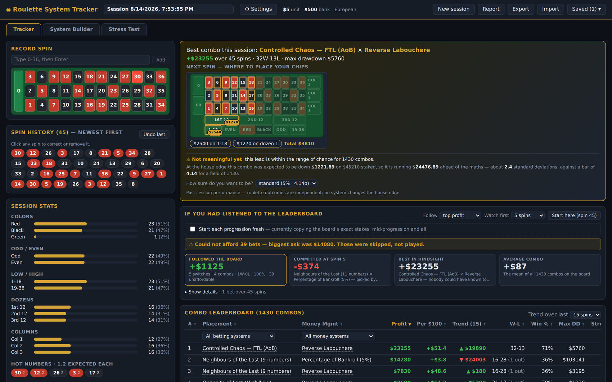
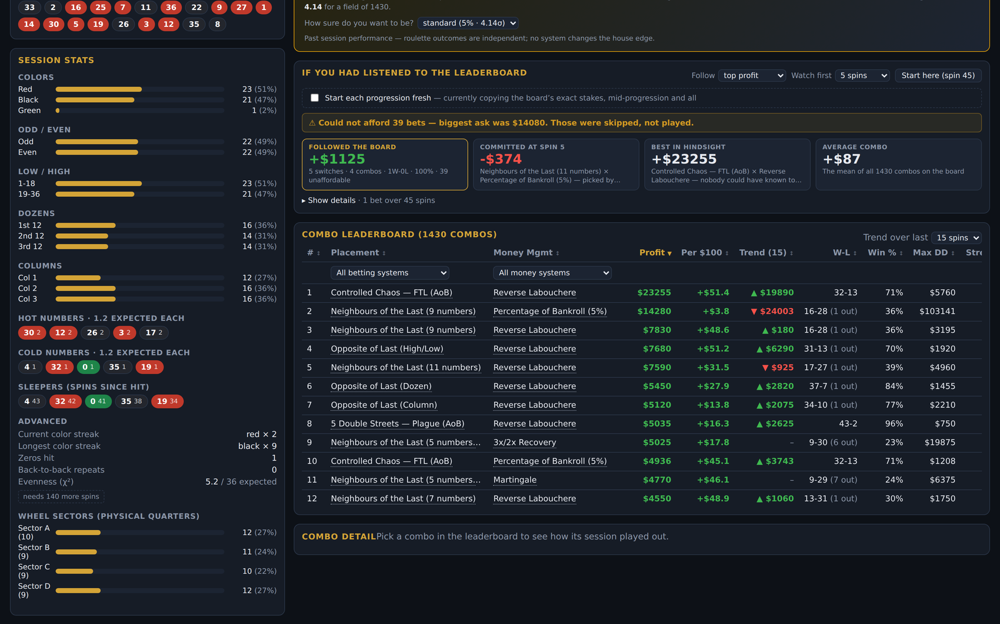
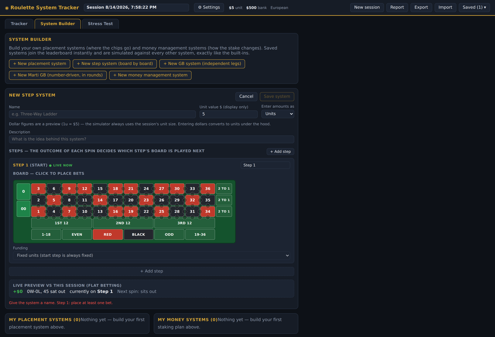
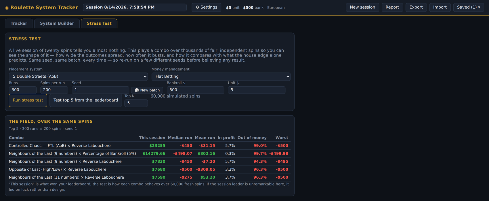

# Roulette System Tracker

[](https://github.com/MateamusPrime/RouletteSystemTracker/actions/workflows/ci.yml)

Real-time roulette session tracker that answers one question while you play:
**which combination of placement system × money management system would be
making the most money in THIS session?**

Enter each spin as it lands. The app replays the full spin history through
every combination of placement system and money system (1,430 of them in the
current build), ranks them on a live leaderboard, and surfaces the best performer
along with the exact bets it wants to place on the next spin — the same idea
Regal Castle applies to baccarat, here for roulette.

## What it looks like

**Tracker.** Enter each spin on the felt as it lands. Every combination is re-simulated over the whole spin history and the leaderboard re-ranks live, alongside basic and advanced session statistics.



**Leaderboard and honesty checks.** The board ranks every combination on profit, per-$100, trend, win-loss, win rate, max drawdown and whether it busted. Above it sit the parts that argue with the leaderboard: a significance bar that accounts for comparing a field this large at once, and a backtest of what following the board's own advice would actually have paid, including the bets you could not have afforded.



**System Builder.** Build a system without writing code. Step systems are board-by-board state machines: place chips on a real felt, then decide where the machine goes based on how many of that step's bets won. Saved systems join the leaderboard instantly and are simulated exactly like the built-ins.



**Stress Test.** Race any combination, or the leaderboard's top five, over thousands of seeded reproducible spins to see the distribution of outcomes, how often it runs out of money, and how it compares against the house edge.



## Run it

**No install, no server, no scripts:** open `RouletteTracker.html` in the
project root. It is the whole app inlined into a single file — double-click it
and it runs in the browser, offline. Sessions and systems save to that
browser's local storage exactly as they would on the dev server. Use this on a
machine where script execution is locked down.

For development:

```bash
npm install
npm run dev               # http://localhost:5173
npm run build             # hostable build in dist/
npm run build:standalone  # regenerate the single-file version
npm run check:standalone  # verify the two single-file builds agree
npm run check:standalone:fresh  # verify the standalone build is current with src/
npm test                  # domain test suite (Vitest)
```

To ship the standalone file with saved systems already in it, export a backup
from the app and bake it in:

```bash
npm run build:standalone
npm run bake -- path/to/roulette-tracker-backup.json
```

The seed applies once, guarded by a marker in local storage, and merges by id —
so it never overwrites newer work and never resurrects something deleted.

`RouletteTracker.html` is exactly `standalone/index.html` with that seed baked
in, so the two must always carry the same app code. `npm run check:standalone`
lifts the seed back out and compares them byte for byte; it runs as part of
`npm run build` and `npm test`, and fails the build if they have drifted. Drift
means the standalone build was regenerated from changed source without
re-baking — which would quietly ship a stale app to anyone opening the file
this README points at. The fix is the two commands above.

Those two files agreeing is not the whole story: a source change that never
gets rebuilt leaves them consistent with each other but both behind `src/`.
`npm run check:standalone:fresh` rebuilds the standalone bundle into a throwaway
directory and compares, so it never rewrites a committed file. Between them the
two checks close the loop — the standalone matches source, and
`RouletteTracker.html` matches the standalone, so both ship the current app.

CI (`.github/workflows/ci.yml`) runs the test suite, both checks and the build
on every pull request and every push to `main`.

## Features

- **Manual spin entry** on a casino-felt number pad (European 0 or American 0/00 wheels)
- **Live combo leaderboard** — profit, win rate, W-L, max drawdown, current streak,
  busted flag; sortable; click a row for its bankroll curve and detail stats
- **Recommendation banner** — best combo so far plus its next-spin bets in dollars
- **Basic stats** — colors, odd/even, high/low, dozens, columns, hot/cold numbers
- **Advanced stats** — sleepers (spins since last hit), color streaks, back-to-back
  repeats, chi-squared vs uniform, physical wheel-sector distribution
- **Sessions** — autosaved to localStorage, resumable, renamable, deletable
- **Table limits** — set the table minimum and the per-bet outside/inside
  maximums. Two ways to enforce them:
  - *Flag mode* (default): combos whose stakes fall outside the limits are
    flagged ⚠ LIMITS, filterable, and skipped by the recommendation.
  - *Cap mode* ("Cap to limits" toggle): bets are constrained to the table and
    played at the ceiling — a Martingale that wants $640 bets the $500 max and
    can only win $500 back, so it can win the spin and still be underwater. The
    review shows "$500 (from $640)" on every capped bet and the leaderboard
    marks the combo ⛶ CAPPED. This answers "does it survive the real ceiling?"
- **Marti GB** is number-driven and played in rounds: pick a number on the
  board and its colour, parity, half, dozen and column each become a leg. A
  leg that **wins stands down** and is not re-bet until every other leg has
  won; then the round is complete and they all come back on the opening bet
  (optionally carrying their progressions instead).
- **GB systems** can also be built from scratch: pick which of the twelve
  outside bets to watch, give each leg its own trigger (asleep for N spins,
  hot in a window, or every spin) and its own stake. *Sleeper GB* runs all
  twelve outside bets — both colors, odd/even, both halves, three dozens, three
  columns — as separate legs. A leg starts betting once it has not hit for the
  session's "GB wait" length, and **each leg runs its own money-management
  progression** while every leg draws on the **same bankroll**, so one leg can
  reset after a win on the very spin another doubles down. Any money system
  layers on, and the shared-bankroll ruin check applies to the combined stake.
- **Session reports** — a printable record of a session: every spin, what the
  wheel did, the top of the leaderboard, and an honest read on whether the
  winner actually meant anything
- **Confidence signals** — the recommendation states whether its lead is
  actually meaningful, comparing the result against what the house edge
  predicts and holding it to a bar that accounts for comparing 100+ combos at
  once. A 20-spin winner is labelled as noise, because it is. The session's
  swing is measured from the bets that were actually placed — a straight-up
  system swings about six times harder than an even-money one for the same
  stake, so judging them alike would make ordinary noise look like an edge.
- **Stress the whole field** — race the leaderboard's leaders over the same
  simulated spins to see whether the session winner is genuinely different or
  merely the luckiest of many
- **Keyboard navigation** — ↑/↓ walk the leaderboard, ←/→ scrub the timeline
- **Stress Test** — run any combo over thousands of simulated spins
  (seeded and reproducible) to see the distribution of outcomes, how often it
  runs out of money, and how it compares with the house-edge expectation
- **Bankroll realism** — a combo stops for good the moment it cannot cover a
  required bet (or loses the lot), marked `OUT (spin N)`. It never bets money
  it does not have and never resumes on a later, cheaper bet, so reported
  profits are bounded by the bankroll you actually brought
- **Share a system by link** — "Share" copies a self-contained link with the
  whole definition in the URL fragment: no server, nothing to expire, and the
  fragment never leaves the browser. Opening one previews the system and offers
  to save **your own copy**, so the author editing theirs later can never change
  the rules a saved session was already simulated against
- **Export / import** — download everything as a JSON backup and restore it
  on another machine; imports merge without overwriting existing work
- **Table profiles** — save a table's limits once ("Mid stakes $25 min") and
  apply them to any session
- **Fast entry** — type a number and press Enter, and click any spin in the
  history to correct or delete it
- **Compare** — pin two combos side by side; every metric marks the better
  side, with an honest note when the gap is smaller than the session's swing
- **Session Review** — spin-by-spin replay of the selected combo: scroll the
  history and see the felt for any spin with the chips that were down, the
  winning pocket ringed, a per-bet breakdown (amount, payout, result) and the
  running bankroll
- **System Builder** — build, save, edit, duplicate, and delete your own placement
  and money management systems in the UI; saved systems join the leaderboard
  instantly and are simulated exactly like the built-ins

## Architecture — designed to scale

```
src/
  domain/
    roulette.ts          wheel data, colors, dozens/columns, physical wheel order
    types.ts             Session, Spin, Bet, SessionConfig
    placement/           WHERE chips go   (PlacementSystem interface + registry)
    money/               HOW MUCH to bet  (MoneyManagementSystem interface + registry)
    simulation.ts        replays every combo over the session's real spins
    stats.ts             basic + advanced session statistics
  storage/
    sessionStore.ts      SessionRepository interface (localStorage impl today)
  components/            React UI (entry pad, leaderboard, stats, session bar)
```

### Building systems in the UI (no code)

The **System Builder** tab lets you compose systems visually and save them
(persisted via `src/storage/customStore.ts`):

Step systems carry their own staking progression, so the leaderboard pairs
them with flat betting as **"Built-in only"** (the system exactly as designed)
and applies every other money system **per completed cycle** — a cycle being
one run from the opening bet back to it. An overlay like Martingale therefore
escalates after a losing *cycle*, never on the intermediate losses the step
system's own progression is there to absorb.

- **Step systems** are board-by-board state machines. Each step is a full
  roulette felt you place chips on exactly like a real table: outside bets,
  straight-up numbers, and inside bets via the hotspots on the lines — click
  between two numbers for a split (17:1), the bottom edge of a column for a
  street (11:1), a four-number intersection for a corner (8:1), or the
  junction of two streets for a six line / double street (5:1).
  After the spin, the number of that step's bets that won decides where the
  machine goes next: any other step, or restart. Steps can be *fixed-funded*
  (stake their listed units) or *carry-funded* — pocket X units of the
  previous step's win and spread the remainder across the step's bets by
  weight (e.g. "all 3 even-money bets hit → pocket 2 units, spread the rest
  across 10 straight numbers"). Transitions are labeled with the net AND
  gross win each outcome produces, and when a hit count is ambiguous (mixed
  payouts) each specific winning combination gets its own destination
  dropdown — route differently depending on WHICH bet won. Carry steps list
  every route that leads into them, offer an outcome picker ("which bet
  wins?") that budgets for a specific winning combination, fund from either
  the gross return (stakes back + winnings) or net profit, and run full
  budget accounting (incoming − pocket = to place, with unplaced /
  overplaced amounts blocking save). A display-only unit value ($) previews
  real dollar amounts everywhere, with a units ⇄ dollars entry toggle for
  placing chips in money terms. The builder shows which step the machine is
  on right now given the live session's spins.
- **Placement systems** are lists of bet rules. Each rule has a *target*
  (fixed bets like red/dozen 2, hand-picked straight-up numbers, hottest or
  coldest dozens/columns/numbers over a configurable look-back, follow or fade
  the last color/dozen/column, physical wheel neighbours, repeat the last
  number), a *trigger condition* (every spin, after an N-long streak, after
  the target has slept ≥ N spins, or when the target is hot), and a unit size.
  Rules fire together, so multi-part systems are one definition.
- **Money systems** come in four styles: *progression* (transform the stake
  on win/loss: reset, hold, ±X, ×X, ÷X, optional reset after N straight wins —
  covers Martingale, Paroli, D'Alembert…), *betting ladder* (any stake
  sequence with configurable movement on win/loss — covers 1-3-2-6,
  Fibonacci…), *cancellation line* (Labouchere with any starting line), and
  *step machine* (arbitrary stakes with free-form win/loss jumps between
  steps). Every style has a stake cap, plus optional *session guards* that
  react to the running profit: walk away at a profit target, stop loss at a
  loss limit (stake drops to 0 for the rest of the session), and stake
  scaling while ahead or behind (press with house money / protect the
  bankroll). *Bank & reset cycles* handle "climb until +$50, take it, start
  over" systems: on reaching a per-cycle profit target the staking plan snaps
  back to its opening stake and a fresh cycle begins (with an optional
  per-cycle stop loss and a cap on how many cycles to run). A preset picker
  seeds common systems — Climb & Bank, Martingale, D'Alembert, Paroli,
  1-3-2-6, Labouchere. Like the step builder, money systems carry a display-only unit
  value ($) and a units ⇄ dollars entry toggle: every stake, cap, and guard
  threshold can be entered in real money, and the live preview reports net,
  gross returned, staked, peak stake and drawdown in the chosen denomination.

Definitions are plain JSON compiled by interpreters in `src/domain/custom/`,
so they persist anywhere JSON does (localStorage today, the future multi-tenant
database later) and behave natively everywhere in the app, including a live
preview against the current session while you edit.

### Adding a placement system in code

Implement the `PlacementSystem` interface in
`src/domain/placement/systems.ts` (or a new file) and add it to
`ALL_PLACEMENT_SYSTEMS`. It receives the full spin history and returns the
bets (numbers covered, payout, relative units) for the next spin. It is
immediately simulated against every money system.

### Adding a money management system

Implement `MoneyManagementSystem` in `src/domain/money/systems.ts` — a tiny
state machine: `initial()`, `multiplier(state)`, `next(state, outcome)` — and
add it to `ALL_MONEY_SYSTEMS`.

### Roadmap to multi-tenant

All persistence goes through the async `SessionRepository` interface in
`src/storage/sessionStore.ts`. To go multi-tenant, implement that interface
against a backend with auth (e.g. Supabase: one `sessions` table with
row-level security per user) and swap the export — no UI or domain changes
required.

## Honest disclaimer

Every spin is independent and every system has the same negative expectation
against the house edge. The leaderboard reports what *has* happened this
session, not what *will* happen. Bet responsibly.
